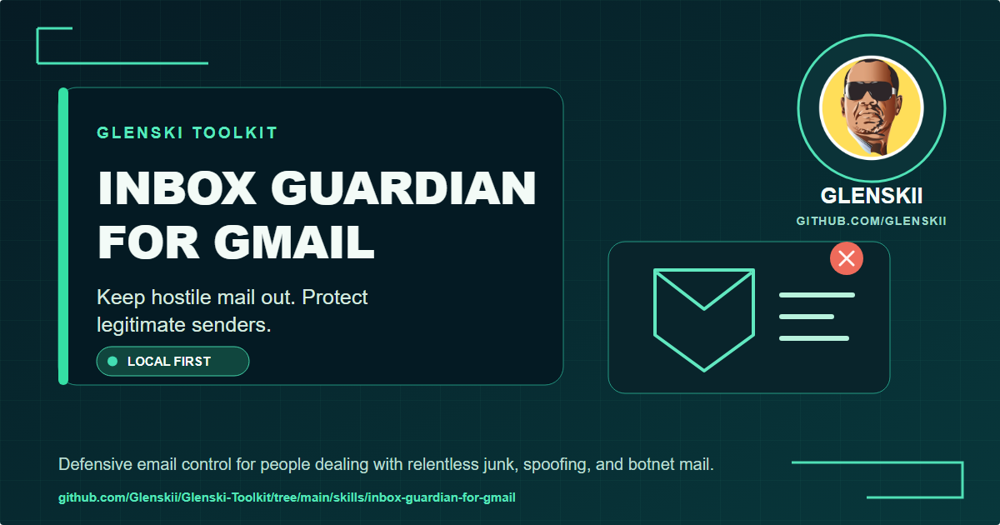
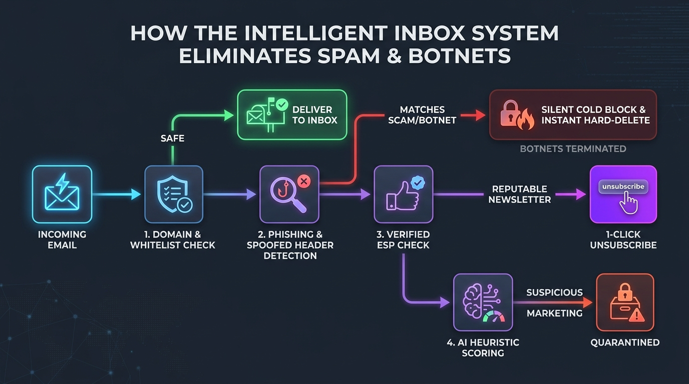

# Inbox Guardian for Gmail (v1.1.0)



> Local Gmail inbox defense with owner-verified rules, audit-first holding pens, and safe recovery paths.
> It runs locally on your computer and connects to Gmail through your personal Google Cloud OAuth client.

[](https://opensource.org/licenses/MIT)
[](https://www.python.org/downloads/)
[]()

---

## System Architecture



---

## What This Tool Does

Inbox Guardian protects your Gmail inbox from spam botnets, fake account warnings, and phishing attacks.
The engine puts human safety first. It never deletes emails from your inbox without your approval.

Key features include:

1. **The Training Depot**: Instead of purging mail, the engine moves suspicious incoming messages into a dedicated holding folder named `Guardian/Review`. This folder acts as an interactive training depot. Messages held here never expire and are never automatically deleted. You can review held messages at your convenience.
2. **Strict Seven-Day Scan Window**: Automated background sweeps are strictly capped to inspect incoming mail from the past seven days (`newer_than:7d`). The engine never scans older mailbox history.
3. **Shared Cloud Infrastructure Firewall**: Spammers often abuse large cloud email providers. The engine includes a built-in safety firewall that protects major cloud networks. These include Amazon SES, SendGrid, Mailgun, Postmark, Mailchimp, Microsoft, Google, Meta, and Resend. The system will never harvest or block these shared delivery networks.
4. **Auto-Harvest Relay Defense**: When an email in your trash is confirmed as a botnet attack, the engine traces the hidden return path. It finds the true root server domain, like rogue `.biz` or `.web.id` farms. It then blocks the entire botnet network permanently.
5. **Two-Way Training Loop**: If you find good mail in your review folder, moving it to your inbox teaches the system to trust that sender. If you confirm a message is junk, the system learns the pattern to stop future attacks.
6. **Live Auto-Refreshing Dashboard**: A clean browser control center gives you live status reports and active whitelist badges. The dashboard updates every fifteen seconds without page reloads.
7. **Least-Privilege Security**: The default Gmail setup inspects headers, applies labels, and moves messages. It does not grant administrative access to your account.
8. **Silent Windows Service**: The engine can run unattended sweeps every fifteen minutes through Windows Task Scheduler. It runs quietly in the background without opening console windows or stealing screen focus.

---

## Requirements

- Python 3.9 or higher
- A personal Gmail or Google Workspace account
- A free Google Cloud OAuth client credentials file (`credentials.json`)

---

## Installation and Setup

### 1. Download and Set Up

#### On macOS and Linux:
```bash
git clone https://github.com/Glenskii/Glenski-Toolkit.git
cd Glenski-Toolkit/skills/inbox-guardian-for-gmail
python3 -m venv .venv
source .venv/bin/activate
pip install -r requirements.txt
pip install -r requirements-dev.txt
cp config.example.json config.json
```

#### On Windows (PowerShell):
```powershell
git clone https://github.com/Glenskii/Glenski-Toolkit.git
cd Glenski-Toolkit\skills\inbox-guardian-for-gmail
python -m venv .venv
.\.venv\Scripts\Activate.ps1
pip install -r requirements.txt
pip install -r requirements-dev.txt
copy config.example.json config.json
```

---

### 2. Google Cloud Setup

Follow the complete [Google OAuth setup guide](docs/google-oauth-setup.md). Place your downloaded Desktop app client file beside `guardian.py` as `credentials.json`, then run:

```bash
python guardian.py --setup
```

The setup command initializes your configuration, opens your default browser for Google consent, stores your token with private permissions, and confirms your mailbox connection.

---

## How to Use the Tool

### 1. Verify Connection and Account
Confirm that your OAuth credentials are valid and display the active account:
```bash
python guardian.py --setup
```

### 2. Open the Visual Dashboard
Generate and open your real-time status report in your web browser:
```bash
python guardian.py --dashboard
```

### 3. Index Your Trusted Contacts
Scan your Sent and Starred messages to populate your local VIP reputation database:
```bash
python guardian.py --seed-reputation
```

### 4. Print a 24-Hour Summary
Display recent activity statistics directly in your terminal:
```bash
python guardian.py --summary
```

### 5. Run an Inbox Audit (Dry Run)
Inspect your recent emails, review classifications, and generate a review file:
```bash
python guardian.py
```
This generates an audit file named `guardian_review_YYYYMMDD_HHMMSS.json`.

### 6. Apply Quarantine from a Review File
Move audited candidates to your `Guardian/Review` holding folder based on your audit:
```bash
python guardian.py --execute --review-file guardian_review_20260826_080000.json
```

### 7. Move Flagged Items to Trash
If you prefer moving audited items directly to your standard Trash:
```bash
python guardian.py --execute --review-file guardian_review_20260826_080000.json --trash
```

### 8. Review Unsubscribe Headers
Inspect incoming messages that provide RFC unsubscribe headers:
```bash
python guardian.py --review-unsub
```

---

## Windows Background Service

After completing setup, you can run the service silently through Windows Task Scheduler. The service defaults to safe quarantine in your `Guardian/Review` folder, maintains your live dashboard, and respects all cloud infrastructure firewalls.

Read the [Windows background-service guide](docs/windows-background-service.md) before installing the task. For a manual audit schedule on any platform, read the [scheduled audit guide](docs/scheduled-runs.md).

---

## Running Tests

To verify that all safety rules and functions pass unit testing:
```bash
pytest tests/ -v
```

---

## Local Data and Privacy

The tool stores its OAuth token, configuration, review files, SQLite reputation database, and activity history locally beside the skill. These private files are ignored by Git and must not be published. The only external connection used by the tool is the official Google Gmail API through your own private credentials. Read [SECURITY.md](SECURITY.md) and the detailed [safety model](docs/safety-model.md).

---

## License

Released under the [MIT License](LICENSE). Copyright (c) 2026 Glen E. Grant.
