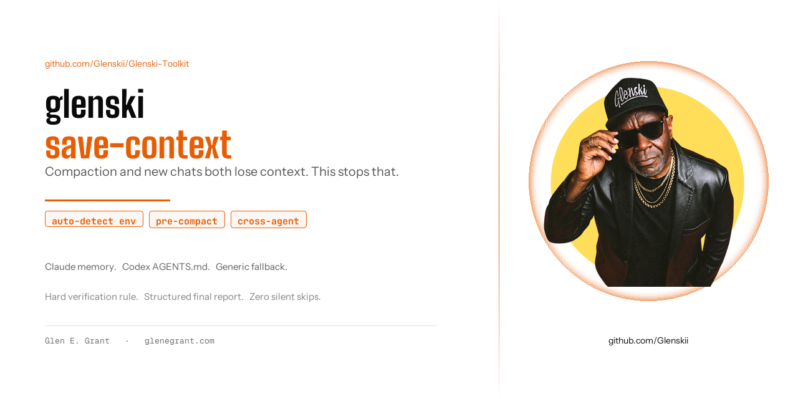

# save-context



**Version:** 1.0 | **Author:** [Glen E. Grant](https://profile.glenegrant.com) | **License:** CC BY 4.0

Stops an AI coding agent from losing everything it learned this session the moment you compact or start a new chat. Detects which agent and persistence mechanism you're running, writes a dated summary to the right place, then proves it did so with a structured report instead of a vague "done!".

---

## The problem

Long agent sessions accumulate context that lives only in the transcript: why a spec was deviated from, what a non-obvious bug actually was, which workaround a broken tool needed. Two things destroy that:

- **Compaction.** `/compact` (or the equivalent in any harness) replaces the real transcript with a lossy summary the agent doesn't control. Anything not written down first is gone.
- **New sessions.** A fresh chat starts with nothing. Whatever the last session learned has to be re-derived from scratch, or it's lost outright.

This skill is the explicit trigger to write durable notes before either of those happens, so continuity survives both.

---

## What it does

1. **Detects the environment.** Checks for a platform-native memory system first (an auto-loaded index plus per-topic notes files, if the harness has one). Falls back to an `AGENTS.md`-style dated-log convention (Codex and similar). Falls back again to a generic `.agent-context/HANDOFF.md` file at the project root if neither is present, so it still works in Antigravity, Grok, or any harness with no detected convention.
2. **Writes a dated, structured section**, not a vague recap: what shipped, any deviation from the literal spec and why, bugs found and root-caused, standing rules established, and what's still pending.
3. **Handles cross-agent handoff** when explicitly requested, since a Claude-native memory write is invisible to Codex and vice versa.
4. **Reports what it did**, structured: environment detected, files written, verification evidence, and a plain bottom line ("Safe to compact" or an honest failure if something couldn't be written).

---

## The bug this skill exists to prevent

An earlier version of this skill, run on a session where nothing had been saved, responded "Already done, I ran this proactively at the end of my last turn," and skipped the write. There was no prior turn. The current version has a hard rule against this: it can never claim a write already happened without actually reading the target file and finding today's dated section covering this session's actual work. No file, no claim of "already done."

---

## Security

Saves decisions, actions, blockers, file paths, commands run, and verification results. Never saves secrets, raw credentials, cookie material, or private data dumps, even when they were visible earlier in the conversation. Sensitive detail gets replaced with a safe description ("OAuth authentication completed") instead of the actual value. Before writing to a repo-local fallback path, checks whether `.gitignore` covers it and warns if it doesn't. If asked to save a secret anyway, it refuses and asks for an intentionally private location instead.

---

## Usage

Trigger it explicitly:

```
save context
```

Or let it fire proactively before `/compact`, before ending a session that did non-trivial work, or when handing off to a different agent. The skill's description is written to trigger on the natural phrases people already use for this ("I need to compact", "let's continue this in a new session").

No setup required for the generic fallback path (`.agent-context/HANDOFF.md`), it creates itself on first use. The platform-native path only activates if your harness already has that kind of memory system in place.

---

## Part of the Glenski-Toolkit

[github.com/Glenskii/Glenski-Toolkit](https://github.com/Glenskii/Glenski-Toolkit), skills for professional web development, creative production, and software quality.

Licensed [CC BY 4.0](https://creativecommons.org/licenses/by/4.0/). Credit: Glen E. Grant, [profile.glenegrant.com](https://profile.glenegrant.com)
