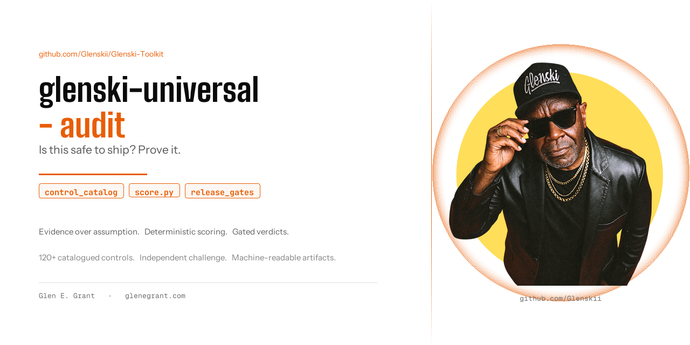

# universal-audit

**A formal, evidence-based software engineering audit skill for Claude Code and
AI-assisted auditors.**

Developed by [Glen E. Grant](https://profile.glenegrant.com).



Built on the **Universal Software Engineering Audit Specification v2.2** - a
full-lifecycle audit standard covering product fitness, security, architecture, data,
supply chain, reliability, recovery, performance, quality, accessibility, UX, privacy,
AI systems, and decommissioning. Written to keep AI auditors honest: evidence over
assumption, deterministic scoring, and release gates that a high score cannot override.

## What it produces

One audit run yields a human report plus machine-readable artifacts:

```text
audits/AUD-MYAPP-20260710-001/
  audit-manifest.json      # who, what, scope, authorization, version
  selected-controls.json   # frozen coverage denominator
  evidence-ledger.json     # every material observation, sanitized
  findings.json            # twenty-field findings
  score-sheet.json         # deterministic scores, caps, coverage, gates
  risk-register.json
  verification-log.json    # independent challenge outcomes
  report.md                # the deliverable
```

The verdict is one of: **APPROVED · APPROVED WITH CONDITIONS · REQUIRES REWORK ·
DO NOT SHIP** - selected by release gates, never by the numeric score alone.

## Why it is different

- **PASS requires affirmative evidence.** Scanner silence is not a pass. Missing
  evidence is UNVERIFIED, reported openly, never hidden inside a lower score.
- **Deterministic scoring.** ~120 catalogued controls with IDs, criticality weights, a
  points table, mandatory caps (an unresolved High FAIL caps its category at 4.9), and a
  bundled scorer (`scripts/score.py`) so two auditors get the same arithmetic.
- **Coverage is honest.** Coverage is reported per tier, and Rapid audits must also
  disclose coverage against the Standard denominator, so a shallow audit cannot look deep.
- **Adversarial by design.** Findings and approval-supporting PASSes survive an
  independent challenge pass before the report releases.
- **No theatre.** No finding quotas, no fashion-driven recommendations, no severity
  inflation, no "AI-generated code" accusations without provenance.
- **Safe by default.** Passive read-only inspection unless written Rules of Engagement
  authorize more. Hard prohibitions that no authorization field overrides.

## Layout

```text
universal-audit/
  SKILL.md                          # execution procedure (the skill entry point)
  spec/                             # the normative specification v2.2
  references/
    depth-and-profiles.md           # tier + risk-profile selection guide
    control-procedures.md           # concrete checks per control family
    templates/                      # intake, RoE, report
    schemas/                        # JSON Schemas for all artifacts
  scripts/
    score.py                        # deterministic scorer (stdlib only, Python 3.10+)
```

## Install

Copy the folder into your skills directory:

```bash
cp -r universal-audit ~/.claude/skills/universal-audit
```

Then ask for a "full audit", "release audit", or "formal audit with a verdict" on any
project. For quick refactor passes, use a lighter review flow - this skill is the
heavyweight tier on purpose.

## Scorer usage

```bash
python scripts/score.py audits/<id>/selected-controls.json \
    --profile P4 --tier standard --out audits/<id>/score-sheet.json
```

No dependencies beyond the Python standard library.

## License

Specification and skill: **CC BY 4.0** - free to use, adapt, and redistribute with
attribution to Glen E. Grant (https://profile.glenegrant.com).
`scripts/score.py`: MIT.
